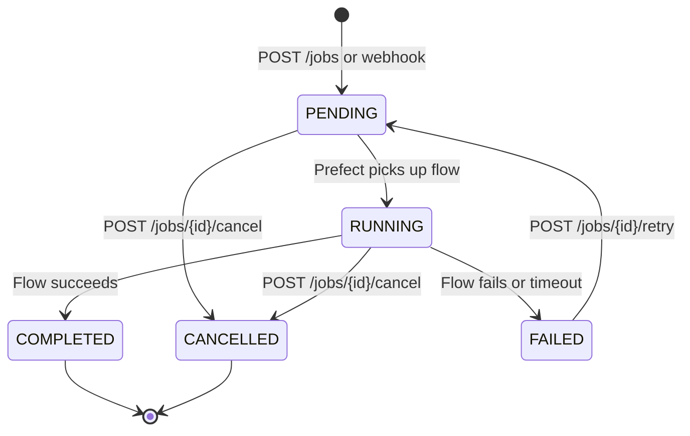

# Data Model: AutoDoc ADK Documentation Generator

**Branch**: `001-autodoc-adk-docgen` | **Date**: 2026-02-15 | **Spec**: [spec.md](./spec.md)

---

## Overview

The AutoDoc ADK data model consists of five persistent database entities (Repository, Job, WikiStructure, WikiPage, PageChunk) stored in PostgreSQL with pgvector, plus two runtime-only data structures (AgentResult, EvaluationResult) that exist in memory during flow execution. A non-database configuration entity (AutodocConfig) is parsed from `.autodoc.yaml` files at runtime.

The database uses a single PostgreSQL instance with the pgvector extension. A separate `prefect` database on the same instance is used by Prefect Server (not covered here).

---

## Entity-Relationship Diagram

```mermaid
erDiagram
    repositories ||--o{ jobs : "has"
    repositories ||--o{ wiki_structures : "has"
    jobs ||--o{ wiki_structures : "produces"
    wiki_structures ||--o{ wiki_pages : "contains"
    wiki_pages ||--o{ page_chunks : "has"

    repositories {
        uuid id PK
        provider_enum provider "github | bitbucket"
        varchar url UK "unique"
        varchar org "extracted from URL"
        varchar name "extracted from URL"
        jsonb branch_mappings "doc branch -> PR target branch"
        varchar public_branch "search default branch"
        varchar access_token "nullable, plaintext in v1"
        timestamp created_at
        timestamp updated_at
    }

    jobs {
        uuid id PK
        uuid repository_id FK "references repositories(id)"
        status_enum status "PENDING | RUNNING | COMPLETED | FAILED | CANCELLED"
        mode_enum mode "full | incremental"
        varchar branch
        varchar commit_sha "nullable"
        boolean force "default false"
        boolean dry_run "default false"
        varchar prefect_flow_run_id "nullable"
        varchar app_commit_sha "nullable"
        jsonb quality_report "nullable"
        jsonb token_usage "nullable"
        jsonb config_warnings "nullable, array"
        varchar callback_url "nullable"
        varchar error_message "nullable"
        varchar pull_request_url "nullable"
        timestamp created_at
        timestamp updated_at
    }

    wiki_structures {
        uuid id PK
        uuid repository_id FK "references repositories(id)"
        uuid job_id FK "references jobs(id)"
        varchar branch
        varchar scope_path "e.g. '.' or 'packages/auth'"
        integer version "1-based, max 3 per scope"
        varchar title
        text description
        jsonb sections "hierarchical page structure"
        varchar commit_sha
        timestamp created_at
        timestamp updated_at
    }

    wiki_pages {
        uuid id PK
        uuid wiki_structure_id FK "references wiki_structures(id) CASCADE"
        varchar page_key "URL-friendly slug"
        varchar title
        text description
        importance_enum importance "high | medium | low"
        page_type_enum page_type "api | module | class | overview"
        jsonb source_files "array of file paths"
        jsonb related_pages "array of page_key references"
        text content "markdown body"
        float quality_score
        timestamp created_at
        timestamp updated_at
    }

    page_chunks {
        uuid id PK
        uuid wiki_page_id FK "references wiki_pages(id) CASCADE"
        integer chunk_index "0-based order within page"
        text content "chunk text"
        vector content_embedding "vector(3072)"
        text_array heading_path "section breadcrumb"
        integer heading_level "0-6"
        integer token_count
        integer start_char "offset in page content"
        integer end_char
        boolean has_code "contains fenced code block"
        timestamp created_at
    }
```



---

## Database Entities

### 1. Repository

A registered Git repository (GitHub or Bitbucket) that the system generates documentation for.

| Column | Type | Constraints | Description |
|--------|------|-------------|-------------|
| `id` | `UUID` | PK, default `gen_random_uuid()` | Primary key |
| `provider` | `VARCHAR` | NOT NULL, CHECK IN ('github', 'bitbucket') | Git hosting provider |
| `url` | `VARCHAR` | NOT NULL, UNIQUE | Full repository URL (e.g., `https://github.com/org/repo`) |
| `org` | `VARCHAR` | NOT NULL | Organization or owner, extracted from URL at registration time |
| `name` | `VARCHAR` | NOT NULL | Repository name, extracted from URL at registration time |
| `branch_mappings` | `JSONB` | NOT NULL | 1:1 mapping of documentation branches to PR target branches |
| `public_branch` | `VARCHAR` | NOT NULL | Single branch whose wiki is returned by all search queries |
| `access_token` | `VARCHAR` | NULLABLE | Plaintext access token for private repos (no encryption in v1) |
| `created_at` | `TIMESTAMP WITH TIME ZONE` | NOT NULL, default `now()` | Record creation time |
| `updated_at` | `TIMESTAMP WITH TIME ZONE` | NOT NULL, default `now()` | Last modification time |

**Validation Rules:**

- `url` must be a valid HTTP(S) URL matching a known provider pattern (GitHub or Bitbucket).
- `provider` must match the URL domain (e.g., `github.com` -> `github`, `bitbucket.org` -> `bitbucket`).
- `org` and `name` are derived from URL parsing and must not be empty.
- `branch_mappings` must be a non-empty JSON object where all keys and values are non-empty strings.
- `public_branch` must be one of the keys in `branch_mappings`.
- `access_token` is nullable for public repositories. If provided, it is stored as plaintext (v1 — no encryption).

**JSONB Schema — `branch_mappings`:**

```json
{
  "type": "object",
  "description": "1:1 mapping of documentation branches to PR target branches",
  "minProperties": 1,
  "additionalProperties": {
    "type": "string",
    "minLength": 1
  },
  "examples": [
    {
      "main": "main"
    },
    {
      "main": "main",
      "develop": "develop"
    }
  ]
}
```

Each key is a documentation branch (the branch whose code is analyzed). Each value is the PR target branch (the branch the generated README PR targets). Multiple branches can trigger documentation generation, but only the `public_branch` documentation is returned by search queries.

---

### 2. Job

A documentation generation task tied to a repository and branch.

| Column | Type | Constraints | Description |
|--------|------|-------------|-------------|
| `id` | `UUID` | PK, default `gen_random_uuid()` | Primary key |
| `repository_id` | `UUID` | NOT NULL, FK -> `repositories(id)` ON DELETE CASCADE | Associated repository |
| `status` | `VARCHAR` | NOT NULL, CHECK IN ('PENDING', 'RUNNING', 'COMPLETED', 'FAILED', 'CANCELLED') | Current job state |
| `mode` | `VARCHAR` | NOT NULL, CHECK IN ('full', 'incremental') | Auto-determined based on stored commit SHA |
| `branch` | `VARCHAR` | NOT NULL | Branch being documented |
| `commit_sha` | `VARCHAR(40)` | NULLABLE | Git commit SHA at time of processing |
| `force` | `BOOLEAN` | NOT NULL, default `false` | When true, force full generation regardless of changes |
| `dry_run` | `BOOLEAN` | NOT NULL, default `false` | When true, extract structure without generating content |
| `prefect_flow_run_id` | `VARCHAR` | NULLABLE | Prefect flow run identifier for status tracking |
| `app_commit_sha` | `VARCHAR(40)` | NULLABLE | Git SHA of the autodoc application (from `APP_COMMIT_SHA` env var) |
| `quality_report` | `JSONB` | NULLABLE | Per-page scores, overall score, regeneration info, README score |
| `token_usage` | `JSONB` | NULLABLE | Total tokens, per-agent breakdown, estimated cost |
| `config_warnings` | `JSONB` | NULLABLE | Array of `.autodoc.yaml` validation warnings |
| `callback_url` | `VARCHAR` | NULLABLE | URL for webhook notification on job completion/failure |
| `error_message` | `TEXT` | NULLABLE | Error details when status is FAILED |
| `pull_request_url` | `VARCHAR` | NULLABLE | URL of created PR (populated on completion) |
| `created_at` | `TIMESTAMP WITH TIME ZONE` | NOT NULL, default `now()` | Record creation time |
| `updated_at` | `TIMESTAMP WITH TIME ZONE` | NOT NULL, default `now()` | Last modification time |

**Validation Rules:**

- `repository_id` must reference an existing repository.
- `branch` must be one of the keys in the referenced repository's `branch_mappings`.
- `mode` is auto-determined by the system, not user-specified. If no WikiStructure exists for the `(repository_id, branch)`, mode is `full`; otherwise `incremental`. The `force` flag overrides this to `full`.
- `commit_sha` is null at creation, populated when the repository is cloned.
- `quality_report`, `token_usage`, and `pull_request_url` are populated upon job completion.
- `config_warnings` is populated during `.autodoc.yaml` loading if unknown keys are found.
- `callback_url`, if provided, must be a valid HTTP(S) URL.
- When an incremental job detects no file changes (and force is false), the job is marked COMPLETED with quality_report set to {"no_changes": true}. No pages are generated, no PR is created.

**JSONB Schema — `quality_report`:**

```json
{
  "type": "object",
  "properties": {
    "overall_score": {
      "type": "number",
      "minimum": 0,
      "maximum": 10,
      "description": "Weighted average score across all pages"
    },
    "quality_threshold": {
      "type": "number",
      "description": "The configured threshold (default 7.0)"
    },
    "passed": {
      "type": "boolean",
      "description": "Whether the overall score met the threshold"
    },
    "total_pages": {
      "type": "integer",
      "description": "Total number of pages generated"
    },
    "pages_below_floor": {
      "type": "integer",
      "description": "Number of pages below the minimum score floor"
    },
    "page_scores": {
      "type": "array",
      "items": {
        "type": "object",
        "properties": {
          "page_key": { "type": "string" },
          "score": { "type": "number" },
          "passed": { "type": "boolean" },
          "attempts": { "type": "integer" },
          "below_minimum_floor": { "type": "boolean" },
          "criteria_scores": {
            "type": "object",
            "additionalProperties": { "type": "number" }
          }
        },
        "required": ["page_key", "score", "passed", "attempts"]
      }
    },
    "readme_score": {
      "type": ["object", "null"],
      "properties": {
        "score": { "type": "number" },
        "passed": { "type": "boolean" },
        "attempts": { "type": "integer" },
        "criteria_scores": {
          "type": "object",
          "additionalProperties": { "type": "number" }
        }
      },
      "description": "README distillation quality score (null for dry_run)"
    },
    "structure_score": {
      "type": ["object", "null"],
      "properties": {
        "score": { "type": "number" },
        "passed": { "type": "boolean" },
        "attempts": { "type": "integer" },
        "criteria_scores": {
          "type": "object",
          "additionalProperties": { "type": "number" }
        }
      },
      "description": "Structure extraction quality score"
    },
    "regenerated_pages": {
      "type": "array",
      "items": { "type": "string" },
      "description": "Page keys that were regenerated (incremental mode)"
    },
    "no_changes": {
      "type": "boolean",
      "description": "True when an incremental job detected no file changes and completed immediately without regeneration"
    }
  },
  "required": ["overall_score", "quality_threshold", "passed", "total_pages"]
}
```

**JSONB Schema — `token_usage`:**

```json
{
  "type": "object",
  "properties": {
    "total_input_tokens": {
      "type": "integer",
      "description": "Total input tokens across all agent calls"
    },
    "total_output_tokens": {
      "type": "integer",
      "description": "Total output tokens across all agent calls"
    },
    "total_tokens": {
      "type": "integer",
      "description": "Sum of input + output tokens"
    },
    "by_agent": {
      "type": "object",
      "properties": {
        "structure_extractor": {
          "$ref": "#/$defs/agent_token_usage"
        },
        "page_generator": {
          "$ref": "#/$defs/agent_token_usage"
        },
        "readme_distiller": {
          "$ref": "#/$defs/agent_token_usage"
        },
        "embedding": {
          "$ref": "#/$defs/agent_token_usage"
        }
      }
    }
  },
  "$defs": {
    "agent_token_usage": {
      "type": "object",
      "properties": {
        "input_tokens": { "type": "integer" },
        "output_tokens": { "type": "integer" },
        "total_tokens": { "type": "integer" },
        "calls": {
          "type": "integer",
          "description": "Number of LLM calls (generator + critic)"
        }
      }
    }
  },
  "required": ["total_input_tokens", "total_output_tokens", "total_tokens"]
}
```

**JSONB Schema — `config_warnings`:**

```json
{
  "type": "array",
  "items": {
    "type": "object",
    "properties": {
      "scope_path": {
        "type": "string",
        "description": "Scope where the warning occurred (e.g., '.', 'packages/auth')"
      },
      "message": {
        "type": "string",
        "description": "Human-readable warning message"
      },
      "key": {
        "type": "string",
        "description": "The unknown or problematic YAML key"
      }
    },
    "required": ["scope_path", "message"]
  }
}
```

#### Job State Transitions



**Transition Rules:**

| From | To | Trigger | Notes |
|------|----|---------|-------|
| `(new)` | `PENDING` | `POST /jobs`, webhook push event | Initial state on creation |
| `PENDING` | `RUNNING` | Prefect flow runner picks up the job | `prefect_flow_run_id` populated |
| `PENDING` | `CANCELLED` | User calls `POST /jobs/{id}/cancel` | For jobs not yet picked up by Prefect (prefect_flow_run_id is null) |
| `RUNNING` | `COMPLETED` | Flow completes all tasks successfully | `quality_report`, `token_usage`, `pull_request_url` populated |
| `RUNNING` | `FAILED` | Flow encounters unrecoverable error or 1-hour timeout | `error_message` populated |
| `RUNNING` | `CANCELLED` | User calls `POST /jobs/{id}/cancel` | Uses Prefect native cancellation |
| `FAILED` | `PENDING` | User calls `POST /jobs/{id}/retry` | Triggers a new Prefect flow run |

**Terminal states**: `COMPLETED` and `CANCELLED` have no outbound transitions.

**Idempotency**: A unique partial index on `(repository_id, branch, dry_run) WHERE status IN ('PENDING', 'RUNNING')` prevents duplicate active jobs. Note that `mode` is excluded from the idempotency key because it is auto-determined by the system and not known at request time.

---

### 3. WikiStructure

A versioned documentation structure for a specific repository, branch, and scope. Contains the hierarchical outline of sections and page specifications.

| Column | Type | Constraints | Description |
|--------|------|-------------|-------------|
| `id` | `UUID` | PK, default `gen_random_uuid()` | Primary key |
| `repository_id` | `UUID` | NOT NULL, FK -> `repositories(id)` ON DELETE CASCADE | Associated repository |
| `job_id` | `UUID` | NULLABLE, FK -> `jobs(id)` ON DELETE SET NULL | Job that produced this structure |
| `branch` | `VARCHAR` | NOT NULL | Branch this structure documents |
| `scope_path` | `VARCHAR` | NOT NULL | Documentation scope (e.g., `"."` for root, `"packages/auth"` for monorepo sub-project) |
| `version` | `INTEGER` | NOT NULL, CHECK >= 1 | 1-based version number within scope |
| `title` | `VARCHAR` | NOT NULL | Wiki title |
| `description` | `TEXT` | NOT NULL | Wiki description |
| `sections` | `JSONB` | NOT NULL | Hierarchical structure of sections and page references |
| `commit_sha` | `VARCHAR(40)` | NOT NULL | Git commit SHA this structure was generated from |
| `created_at` | `TIMESTAMP WITH TIME ZONE` | NOT NULL, default `now()` | Record creation time |
| `updated_at` | `TIMESTAMP WITH TIME ZONE` | NOT NULL, default `now()` | Last modification time |

**Unique Constraint:** `(repository_id, branch, scope_path, version)` — no two structures may share the same scope at the same version.

**Validation Rules:**

- `repository_id` must reference an existing repository.
- `job_id` is nullable and must reference an existing job when set (SET NULL on job deletion to preserve structure provenance history).
- `scope_path` is `"."` for single-scope repositories or a relative path for monorepo sub-projects.
- `version` starts at 1 and increments. Maximum 3 versions are retained per `(repository_id, branch, scope_path)`. When a 4th version is created, the oldest (lowest version number) is deleted, which cascades to delete its wiki pages.
- `sections` must conform to the JSONB schema below.

**JSONB Schema — `sections`:**

```json
{
  "type": "array",
  "items": {
    "$ref": "#/$defs/section"
  },
  "$defs": {
    "section": {
      "type": "object",
      "properties": {
        "title": {
          "type": "string",
          "description": "Section heading"
        },
        "description": {
          "type": "string",
          "description": "Brief section description"
        },
        "order": {
          "type": "integer",
          "description": "Display order within parent (0-based)"
        },
        "pages": {
          "type": "array",
          "items": {
            "$ref": "#/$defs/page_spec"
          },
          "description": "Pages belonging to this section"
        },
        "subsections": {
          "type": "array",
          "items": {
            "$ref": "#/$defs/section"
          },
          "description": "Nested subsections (recursive)"
        }
      },
      "required": ["title", "order", "pages"]
    },
    "page_spec": {
      "type": "object",
      "properties": {
        "page_key": {
          "type": "string",
          "description": "URL-friendly unique identifier for the page"
        },
        "title": {
          "type": "string",
          "description": "Page title"
        },
        "description": {
          "type": "string",
          "description": "Brief page description for the table of contents"
        },
        "importance": {
          "type": "string",
          "enum": ["high", "medium", "low"],
          "description": "Page importance for prioritization"
        },
        "page_type": {
          "type": "string",
          "enum": ["api", "module", "class", "overview"],
          "description": "Type of documentation page"
        },
        "source_files": {
          "type": "array",
          "items": { "type": "string" },
          "description": "Source files this page documents"
        },
        "related_pages": {
          "type": "array",
          "items": { "type": "string" },
          "description": "page_key values of related pages"
        },
        "order": {
          "type": "integer",
          "description": "Display order within section (0-based)"
        }
      },
      "required": ["page_key", "title", "importance", "page_type", "source_files"]
    }
  }
}
```

**Example — `sections`:**

```json
[
  {
    "title": "Getting Started",
    "description": "Introduction and setup guides",
    "order": 0,
    "pages": [
      {
        "page_key": "overview",
        "title": "Project Overview",
        "description": "High-level architecture and design",
        "importance": "high",
        "page_type": "overview",
        "source_files": ["README.md", "docs/architecture.md"],
        "related_pages": ["installation", "configuration"],
        "order": 0
      },
      {
        "page_key": "installation",
        "title": "Installation Guide",
        "description": "How to install and configure",
        "importance": "high",
        "page_type": "overview",
        "source_files": ["setup.py", "Dockerfile"],
        "related_pages": ["overview"],
        "order": 1
      }
    ],
    "subsections": []
  },
  {
    "title": "API Reference",
    "description": "REST API endpoint documentation",
    "order": 1,
    "pages": [
      {
        "page_key": "api-authentication",
        "title": "Authentication API",
        "description": "Auth endpoints and token management",
        "importance": "high",
        "page_type": "api",
        "source_files": ["src/api/routes/auth.py", "src/api/schemas/auth.py"],
        "related_pages": ["api-users"],
        "order": 0
      }
    ],
    "subsections": []
  }
]
```

---

### 4. WikiPage

A single generated documentation page belonging to a WikiStructure. Contains the full markdown content, quality score, and metadata.

| Column | Type | Constraints | Description |
|--------|------|-------------|-------------|
| `id` | `UUID` | PK, default `gen_random_uuid()` | Primary key |
| `wiki_structure_id` | `UUID` | NOT NULL, FK -> `wiki_structures(id)` ON DELETE CASCADE | Parent structure |
| `page_key` | `VARCHAR` | NOT NULL | URL-friendly page identifier (unique within structure) |
| `title` | `VARCHAR` | NOT NULL | Page title |
| `description` | `TEXT` | NOT NULL | Brief page description |
| `importance` | `VARCHAR` | NOT NULL, CHECK IN ('high', 'medium', 'low') | Page priority |
| `page_type` | `VARCHAR` | NOT NULL, CHECK IN ('api', 'module', 'class', 'overview') | Documentation type |
| `source_files` | `JSONB` | NOT NULL | Array of source file paths this page documents |
| `related_pages` | `JSONB` | NOT NULL, default `'[]'` | Array of page_key references to related pages |
| `content` | `TEXT` | NOT NULL | Full markdown body of the page |
| `quality_score` | `FLOAT` | NOT NULL | Critic evaluation score (1.0-10.0) |
| `created_at` | `TIMESTAMP WITH TIME ZONE` | NOT NULL, default `now()` | Record creation time |
| `updated_at` | `TIMESTAMP WITH TIME ZONE` | NOT NULL, default `now()` | Last modification time |

**Validation Rules:**

- `wiki_structure_id` must reference an existing wiki structure. CASCADE DELETE ensures pages are cleaned up when the structure is removed.
- `page_key` must be unique within a given `wiki_structure_id`. Composed of lowercase alphanumeric characters, hyphens, and forward slashes only (URL-safe).
- `importance` and `page_type` must match the values from the parent structure's `sections` page spec.
- `source_files` must be a non-empty JSON array of strings (relative file paths).
- `related_pages` must be a JSON array of strings; each string should reference a valid `page_key` within the same wiki structure.
- `content` must be non-empty markdown text.
- `quality_score` is the weighted average from the Critic evaluation, range 1.0 to 10.0.

**JSONB Schema — `source_files`:**

```json
{
  "type": "array",
  "items": {
    "type": "string",
    "description": "Relative file path from repository root"
  },
  "minItems": 1,
  "examples": [
    ["src/api/routes/auth.py", "src/api/schemas/auth.py"],
    ["src/models/user.py"]
  ]
}
```

**JSONB Schema — `related_pages`:**

```json
{
  "type": "array",
  "items": {
    "type": "string",
    "description": "page_key of a related page within the same wiki structure"
  },
  "examples": [
    ["api-users", "authentication-overview"],
    []
  ]
}
```

**Cascade Behavior:** When a WikiStructure is deleted (either through version retention cleanup or repository deletion), all associated WikiPages are automatically deleted via the `ON DELETE CASCADE` foreign key constraint. This cascades further to PageChunks: `wiki_structures -> wiki_pages -> page_chunks`. This is the primary cleanup mechanism.

---

### 5. PageChunk

A chunk of a wiki page with its vector embedding. Enables fine-grained semantic search by splitting long pages into smaller sections.

| Column | Type | Constraints | Description |
|--------|------|-------------|-------------|
| `id` | `UUID` | PK, default `gen_random_uuid()` | Primary key |
| `wiki_page_id` | `UUID` | NOT NULL, FK -> `wiki_pages(id)` ON DELETE CASCADE | Parent wiki page |
| `chunk_index` | `INTEGER` | NOT NULL, CHECK >= 0 | 0-based ordering within the page |
| `content` | `TEXT` | NOT NULL | Chunk text content |
| `content_embedding` | `VECTOR(3072)` | NULLABLE | pgvector embedding of the chunk text |
| `heading_path` | `TEXT[]` | NOT NULL, default `'{}'` | Section breadcrumb (e.g., `["Authentication", "JWT Validation"]`) |
| `heading_level` | `INTEGER` | NOT NULL, CHECK >= 0 AND <= 6 | 0 for preamble, 1-6 for heading levels |
| `token_count` | `INTEGER` | NOT NULL, CHECK >= 0 | Token count computed at chunk creation time |
| `start_char` | `INTEGER` | NOT NULL, CHECK >= 0 | Character offset start in parent page content |
| `end_char` | `INTEGER` | NOT NULL, CHECK > start_char | Character offset end in parent page content |
| `has_code` | `BOOLEAN` | NOT NULL, default `false` | Whether the chunk contains a fenced code block |
| `created_at` | `TIMESTAMP WITH TIME ZONE` | NOT NULL, default `now()` | Record creation time |

**Unique Constraint:** `(wiki_page_id, chunk_index)` — no two chunks may share the same index within a page.

**Validation Rules:**

- `wiki_page_id` must reference an existing wiki page. CASCADE DELETE ensures chunks are cleaned up when page is removed.
- `chunk_index` starts at 0 and increments. Represents ordering within the page.
- `heading_path` is a text array representing the section breadcrumb (e.g., `["Authentication", "JWT Validation"]`). Empty for preamble content before the first heading.
- `heading_level` is 0 for preamble, 1-6 for heading levels.
- `token_count` is computed at chunk creation time using `cl100k_base` encoding.
- `start_char` and `end_char` are character offsets into the parent page's `content` field.
- `has_code` is `true` if the chunk contains a fenced code block.
- `content_embedding` is generated using the configured embedding model (default: `text-embedding-3-large`, 3072 dimensions).

---

## Runtime-Only Entities (Not Persisted)

These entities exist only in memory during Prefect flow execution. Their aggregate data is persisted in the Job's `quality_report` and `token_usage` JSONB fields.

### 6. AutodocConfig

Parsed from `.autodoc.yaml` files discovered in the repository. Not stored in the database.

```
AutodocConfig
  version: int = 1
  include: list[str] = []              # Empty = all files; non-empty = ONLY those paths
  exclude: list[str] = [defaults]      # Paths to exclude (minus includes)
  style: StyleConfig
    audience: str = "junior-developer" # Target audience
    tone: str = "tutorial"             # Writing tone
    detail_level: str = "comprehensive"# Level of detail
  custom_instructions: str | None      # Free-form text injected into agent prompts
  readme: ReadmeConfig
    output_path: str = "README.md"     # Relative to .autodoc.yaml directory
    max_length: int | None = None      # Word cap (null = unlimited)
    include_toc: bool = true           # Include table of contents
    include_badges: bool = true        # Include status badges
  pull_request: PRConfig
    auto_merge: bool = false           # Auto-merge the generated PR
    reviewers: list[str] = []          # PR reviewer usernames
```

**Validation Rules:**

- `version` must be `1` (only supported version).
- `include`: empty list means all files are included. Non-empty list means ONLY those paths (minus excludes).
- `exclude`: applied after include filtering.
- `readme.output_path`: must be a relative path (no leading `/`), resolved relative to the `.autodoc.yaml` file's directory.
- `readme.max_length`: `null` means unlimited; integer value is a word cap. No sentinel strings.
- Unknown keys produce warnings (stored in Job's `config_warnings`); invalid values cause a `PermanentError` that fails the job.

### 7. AgentResult\<T\>

Wrapper returned by all agents (StructureExtractor, PageGenerator, ReadmeDistiller) carrying the output alongside quality metadata and token usage.

```
AgentResult[T]
  output: T                                  # The generated content (type varies by agent)
  attempts: int                              # Number of Generator-Critic loop iterations
  final_score: float                         # Best score achieved (1.0-10.0)
  passed_quality_gate: bool                  # Whether final_score >= quality_threshold
  below_minimum_floor: bool                  # Whether any criterion fell below its floor
  evaluation_history: list[EvaluationResult] # All evaluation results across attempts
  token_usage: TokenUsage                    # Aggregated token consumption
```

**Output types by agent:**

| Agent | Output Type `T` | Description |
|-------|-----------------|-------------|
| StructureExtractor | `WikiStructureSpec` | Sections hierarchy with page specifications |
| PageGenerator | `GeneratedPage` | Single page with markdown content |
| ReadmeDistiller | `ReadmeOutput` | Distilled README markdown |

### 8. EvaluationResult

Produced by the Critic sub-agent after evaluating Generator output against a weighted rubric.

```
EvaluationResult
  score: float                    # Weighted average score (1.0-10.0)
  passed: bool                    # Whether score >= quality_threshold
  feedback: str                   # Improvement suggestions for retry
  criteria_scores: dict[str, float] # Per-criterion scores (e.g., {"accuracy": 8.0, "completeness": 6.5})
  criteria_weights: dict[str, float] # Criterion weights (e.g., {"accuracy": 0.35, "completeness": 0.25})
```

**Critic Failure Resilience:** If the Critic LLM call fails (rate limit, timeout), the attempt is auto-passed with a warning. The pipeline does not crash. The `evaluation_history` records the auto-pass event.

---

## Database Indexes

### Primary Keys

All tables use `UUID` primary keys with `gen_random_uuid()` defaults.

### Unique Constraints and Indexes

| Table | Index Name | Columns / Expression | Type | Purpose |
|-------|-----------|----------------------|------|---------|
| `repositories` | `uq_repositories_url` | `(url)` | UNIQUE | Prevent duplicate repository registrations |
| `wiki_structures` | `uq_wiki_structures_scope_version` | `(repository_id, branch, scope_path, version)` | UNIQUE | Prevent duplicate versions for the same scope |
| `jobs` | `uq_jobs_active_idempotency` | `(repository_id, branch, dry_run) WHERE status IN ('PENDING', 'RUNNING')` | UNIQUE PARTIAL | Job idempotency: prevent duplicate active jobs for the same repo+branch+dry_run combination. `mode` is excluded because it is auto-determined at runtime. |
| `page_chunks` | `uq_page_chunks_index` | `(wiki_page_id, chunk_index)` | UNIQUE | One chunk per (page, index) pair |
| `wiki_pages` | `uq_wiki_pages_structure_page_key` | `(wiki_structure_id, page_key)` | UNIQUE | One page_key per wiki structure |

### Performance Indexes

| Table | Index Name | Columns / Expression | Type | Purpose |
|-------|-----------|----------------------|------|---------|
| `jobs` | `ix_jobs_repository_status` | `(repository_id, status)` | B-tree | Fast job lookup by repository and status |
| `jobs` | `ix_jobs_idempotency_lookup` | `(repository_id, branch, dry_run, status)` | B-tree | Fast idempotency check before insert |
| `wiki_pages` | `ix_wiki_pages_content_fts` | `to_tsvector('english', content)` | GIN | Full-text search on page content |
| `wiki_pages` | `ix_wiki_pages_structure_id` | `(wiki_structure_id)` | B-tree | Fast page lookup by parent structure |
| `wiki_structures` | `ix_wiki_structures_repo_branch` | `(repository_id, branch)` | B-tree | Fast structure lookup by repository and branch |
| `page_chunks` | `ix_page_chunks_embedding` | `(content_embedding)` | HNSW (cosine) | Semantic search on chunks |
| `page_chunks` | `ix_page_chunks_page_id` | `(wiki_page_id)` | B-tree | Fast chunk lookup by parent page |

### Index Implementation Notes

**GIN Index (Full-Text Search):**

```sql
CREATE INDEX ix_wiki_pages_content_fts
    ON wiki_pages USING GIN (to_tsvector('english', content));
```

Used by text search queries with `ts_query` for keyword-based documentation search.

**HNSW Index (Semantic Search):**

```sql
CREATE INDEX ix_page_chunks_embedding
    ON page_chunks USING hnsw (content_embedding vector_cosine_ops);
```

Used by semantic search queries for approximate nearest neighbor lookup on chunk embeddings. HNSW provides a good trade-off between recall and query speed for the expected data volume.

**Partial Unique Index (Job Idempotency):**

```sql
CREATE UNIQUE INDEX uq_jobs_active_idempotency
    ON jobs (repository_id, branch, dry_run)
    WHERE status IN ('PENDING', 'RUNNING');
```

Enforces at the database level that only one active job exists per `(repository_id, branch, dry_run)` combination. Completed, failed, and cancelled jobs are excluded from the constraint, allowing new jobs to be created for the same parameters.

---

## Foreign Key Relationships

| Parent Table | Child Table | FK Column | ON DELETE | Rationale |
|-------------|-------------|-----------|-----------|-----------|
| `repositories` | `jobs` | `repository_id` | `CASCADE` | Deleting a repository removes all its jobs |
| `repositories` | `wiki_structures` | `repository_id` | `CASCADE` | Deleting a repository removes all its wiki structures |
| `jobs` | `wiki_structures` | `job_id` | `SET NULL` | Deleting a job preserves wiki structures (provenance becomes null) |
| `wiki_structures` | `wiki_pages` | `wiki_structure_id` | `CASCADE` | Deleting a wiki structure removes all its pages |
| `wiki_pages` | `page_chunks` | `wiki_page_id` | `CASCADE` | Deleting a wiki page removes all its chunks and embeddings |

**Cascade chain on repository deletion:**

```
DELETE repository
  -> CASCADE DELETE jobs
  -> CASCADE DELETE wiki_structures
       -> CASCADE DELETE wiki_pages
            -> CASCADE DELETE page_chunks
```

This ensures complete cleanup with no orphaned records when a repository is removed via `DELETE /repositories/{id}`.

---

## Enumeration Types

These are implemented as PostgreSQL CHECK constraints (not native ENUM types) for simpler migration management.

| Enum | Values | Used In |
|------|--------|---------|
| Provider | `github`, `bitbucket` | `repositories.provider` |
| JobStatus | `PENDING`, `RUNNING`, `COMPLETED`, `FAILED`, `CANCELLED` | `jobs.status` |
| JobMode | `full`, `incremental` | `jobs.mode` |
| PageImportance | `high`, `medium`, `low` | `wiki_pages.importance` |
| PageType | `api`, `module`, `class`, `overview` | `wiki_pages.page_type` |

---

## Version Retention Policy

WikiStructures are versioned per `(repository_id, branch, scope_path)`. The system retains a maximum of **3 versions** per scope.

**Retention logic (enforced at the application level):**

1. When creating a new WikiStructure, query the current version count for the scope.
2. If count >= 3, delete the oldest version (lowest `version` number).
3. Deletion of the oldest WikiStructure cascades to delete all associated WikiPages and their PageChunks.
4. Insert the new WikiStructure with `version = max(existing versions) + 1`.

This ensures bounded storage growth while preserving recent documentation history for comparison.

---

## Search Implementation

Documentation search supports three modes, all of which default to the repository's `public_branch`.

**Text Search** uses PostgreSQL's full-text search capabilities on full page content:

```sql
SELECT wp.*, ts_rank(to_tsvector('english', wp.content), plainto_tsquery('english', :query)) AS rank
FROM wiki_pages wp
JOIN wiki_structures ws ON wp.wiki_structure_id = ws.id
WHERE ws.repository_id = :repo_id
  AND ws.branch = :branch
  -- Optional: AND ws.scope_path = :scope_path (when scope parameter is provided)
  AND ws.version = (SELECT MAX(version) FROM wiki_structures WHERE repository_id = :repo_id AND branch = :branch AND scope_path = ws.scope_path)
  AND to_tsvector('english', wp.content) @@ plainto_tsquery('english', :query)
ORDER BY rank DESC;
```

**Semantic Search** uses pgvector's cosine distance on page chunks, then aggregates to page level using best-chunk-wins:

```sql
WITH chunk_matches AS (
    SELECT
        pc.wiki_page_id,
        pc.content AS chunk_content,
        pc.heading_path,
        pc.chunk_index,
        1 - (pc.content_embedding <=> :query_embedding) AS similarity,
        ROW_NUMBER() OVER (PARTITION BY pc.wiki_page_id ORDER BY pc.content_embedding <=> :query_embedding) AS rn
    FROM page_chunks pc
    JOIN wiki_pages wp ON pc.wiki_page_id = wp.id
    JOIN wiki_structures ws ON wp.wiki_structure_id = ws.id
    WHERE ws.repository_id = :repo_id
      AND ws.branch = :branch
      -- Optional: AND ws.scope_path = :scope_path (when scope parameter is provided)
      AND ws.version = (SELECT MAX(version) FROM wiki_structures WHERE repository_id = :repo_id AND branch = :branch AND scope_path = ws.scope_path)
      AND pc.content_embedding IS NOT NULL
    ORDER BY pc.content_embedding <=> :query_embedding
    LIMIT :chunk_limit
)
SELECT wp.*, cm.similarity, cm.chunk_content AS best_chunk_content, cm.heading_path AS best_chunk_heading_path
FROM chunk_matches cm
JOIN wiki_pages wp ON cm.wiki_page_id = wp.id
WHERE cm.rn = 1
ORDER BY cm.similarity DESC
LIMIT :limit;
```

**Hybrid Search** combines text and semantic results using Reciprocal Rank Fusion (RRF) with `k=60`. Semantic search operates on chunks (finding the most relevant chunk per page), while full-text search operates on full page content. RRF merges at the page level using best-chunk-wins aggregation. Pages absent from one result set receive a penalty rank of 1000 (not 0) to avoid inflating their combined score.

```sql
WITH semantic_chunks AS (
    SELECT
        pc.wiki_page_id,
        pc.content AS chunk_content,
        pc.heading_path,
        1 - (pc.content_embedding <=> :query_embedding) AS similarity,
        ROW_NUMBER() OVER (PARTITION BY pc.wiki_page_id ORDER BY pc.content_embedding <=> :query_embedding) AS rn
    FROM page_chunks pc
    JOIN wiki_pages wp ON pc.wiki_page_id = wp.id
    JOIN wiki_structures ws ON wp.wiki_structure_id = ws.id
    WHERE ws.repository_id = :repo_id
      AND ws.branch = :branch
      -- Optional: AND ws.scope_path = :scope_path (when scope parameter is provided)
      AND ws.version = (SELECT MAX(version) FROM wiki_structures WHERE repository_id = :repo_id AND branch = :branch AND scope_path = ws.scope_path)
      AND pc.content_embedding IS NOT NULL
    ORDER BY pc.content_embedding <=> :query_embedding
    LIMIT :chunk_limit
),
semantic_pages AS (
    SELECT wiki_page_id, chunk_content, heading_path, similarity,
           ROW_NUMBER() OVER (ORDER BY similarity DESC) AS rank_semantic
    FROM semantic_chunks
    WHERE rn = 1
),
text_results AS (
    SELECT wp.id AS wiki_page_id,
           ts_rank(to_tsvector('english', wp.content), plainto_tsquery('english', :query)) AS text_rank,
           ROW_NUMBER() OVER (ORDER BY ts_rank(to_tsvector('english', wp.content), plainto_tsquery('english', :query)) DESC) AS rank_text
    FROM wiki_pages wp
    JOIN wiki_structures ws ON wp.wiki_structure_id = ws.id
    WHERE ws.repository_id = :repo_id
      AND ws.branch = :branch
      -- Optional: AND ws.scope_path = :scope_path (when scope parameter is provided)
      AND ws.version = (SELECT MAX(version) FROM wiki_structures WHERE repository_id = :repo_id AND branch = :branch AND scope_path = ws.scope_path)
      AND to_tsvector('english', wp.content) @@ plainto_tsquery('english', :query)
),
combined AS (
    SELECT
        COALESCE(sp.wiki_page_id, tr.wiki_page_id) AS wiki_page_id,
        sp.chunk_content AS best_chunk_content,
        sp.heading_path AS best_chunk_heading_path,
        1.0 / (60 + COALESCE(tr.rank_text, 1000)) + 1.0 / (60 + COALESCE(sp.rank_semantic, 1000)) AS rrf_score
    FROM semantic_pages sp
    FULL OUTER JOIN text_results tr ON sp.wiki_page_id = tr.wiki_page_id
)
SELECT wp.*, c.rrf_score, c.best_chunk_content, c.best_chunk_heading_path
FROM combined c
JOIN wiki_pages wp ON c.wiki_page_id = wp.id
ORDER BY c.rrf_score DESC
LIMIT :limit;
```

```
RRF_score(page) = 1/(k + rank_text) + 1/(k + rank_semantic)

where:
  k = 60
  rank_text = position in text search results (or 1000 if absent)
  rank_semantic = position in semantic search results based on best chunk (or 1000 if absent)
```

---

## Database Configuration

| Parameter | Env Var | Default | Description |
|-----------|---------|---------|-------------|
| Connection pool size | `DB_POOL_SIZE` | 5 | SQLAlchemy async pool size |
| Max overflow | `DB_MAX_OVERFLOW` | 10 | Additional connections beyond pool size |
| Pool timeout | `DB_POOL_TIMEOUT` | 30 | Seconds to wait for a connection from the pool |
| Pool recycle | `DB_POOL_RECYCLE` | 3600 | Seconds before a connection is recycled (prevents stale connections) |
| Database URL | `DATABASE_URL` | — | PostgreSQL connection string (asyncpg) |
| Chunk max tokens | `CHUNK_MAX_TOKENS` | 512 | Maximum tokens per chunk |
| Chunk overlap tokens | `CHUNK_OVERLAP_TOKENS` | 50 | Token overlap between consecutive sub-chunks |
| Chunk min tokens | `CHUNK_MIN_TOKENS` | 50 | Minimum chunk size (smaller merged with neighbor) |
| Embedding batch size | `EMBEDDING_BATCH_SIZE` | 100 | Number of chunks to embed per API call |

**Column Convention — `updated_at`:** All `updated_at` columns use SQLAlchemy's `onupdate=func.now()` parameter to auto-set the timestamp on every UPDATE. No database-level triggers are required.

---

## Migration Strategy

Database migrations are managed by Alembic (SQLAlchemy's migration tool) with async support via asyncpg.

- Migration files live in `src/database/migrations/versions/`.
- Prefect Server auto-manages its own database schema via Alembic on startup (`PREFECT_API_DATABASE_MIGRATE_ON_START=True` default). We do not manage Prefect's tables.
- The `init-db.sql` script in `deployment/scripts/` creates the `prefect` database and the pgvector extension on the `autodoc` database. No `pg_trgm` creation is needed in our scripts -- Prefect's own migrations handle any extensions it requires.
- Two separate Alembic migration paths exist: Prefect manages its own tables in the `prefect` database, and we manage application tables (`repositories`, `jobs`, `wiki_structures`, `wiki_pages`, `page_chunks`) in the `autodoc` database.
- The pgvector extension must be created before running application migrations: `CREATE EXTENSION IF NOT EXISTS vector;` (handled by `init-db.sql`).
- Enum values are implemented as CHECK constraints to simplify adding new values via standard ALTER TABLE migrations rather than requiring PostgreSQL ENUM type alterations.
